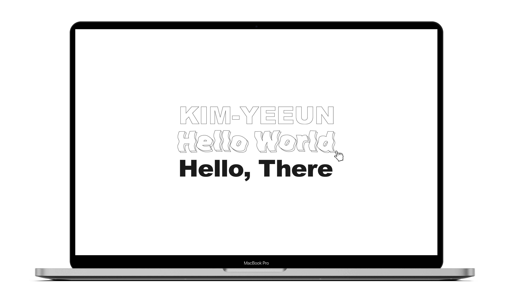

# YeeunKim⏤@cona-tus ✨

 

 
 

## 👋 Greeting

 

Hello, there! I'm Yeeun. I'm a junior developer who lives in Seoul.

I’ve dreamed that I could make someone’s life easier. I learn programming to connect people to the world. My goal with coding is to make applications for disadvantaged groups.

I'm hungry to learn, and I learn what I don't know with an open mind. I believe that I will become a hardworking front-end developer.

I'm ready to go for it!

 

 
 

## 🌱 Learning

 

<!--   -->

 
 
